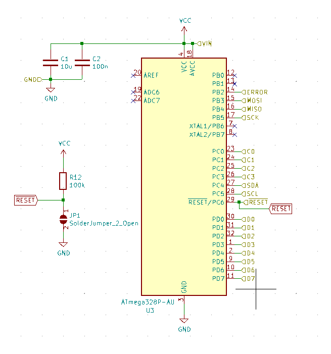
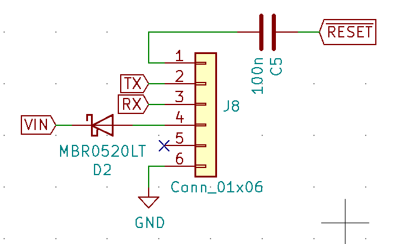
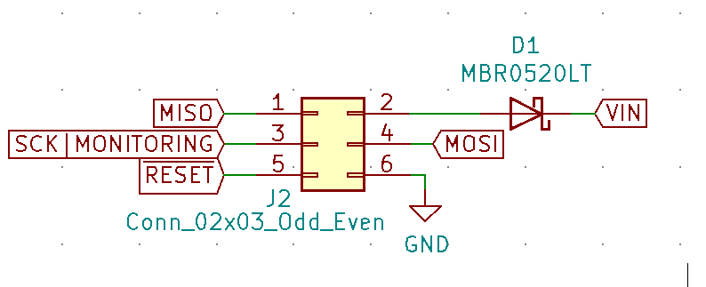
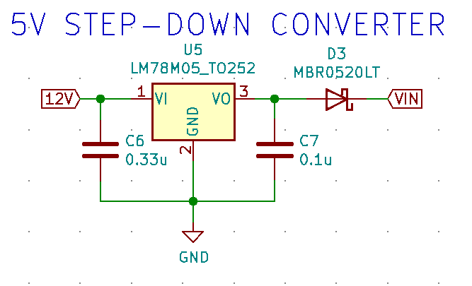

# Simple incubator

The goal is to create a simple controller of temperature for an incubator.

## Pinout

| Pin Port | Function | Incubator Functions       | Description                                                                                              |
| -------- | -------- | ------------------------- | -------------------------------------------------------------------------------------------------------- |
| PC6      | /RESET   | /RESET                    | - Low level Reset pin.   - DTS pin for Serial communication.   - SS pin for SPI communication. |
| PD0      | 0        | RX                        | RX pin for Serial communication.                                                                         |
| PD1      | 1        | TX                        | TX pin for Serial communication.                                                                         |
| PD5      | 5        | OUT_FAN                   | Pin for fan control.                                                                                     |
| PD6      | 6        | PID_CONTROL               | Pin for PID control (need to have PWM).                                                                  |
| PB2      | 10       | OUT_ERROR                 | Pin for Error notification.                                                                              |
| PB3      | MOSI     | MOSI                      | MOSI pin for SPI communication.                                                                          |
| PB4      | MISO     | MISO                      | MISO pin for SPI communication.                                                                          |
| PB5      | 13       | SCK   MONITORING_LED | - SCK pin for SPI communication.   - Pin for Monitoring LED.                                        |
| PC0      | A0       | TEMP_EXT3                 | Pin for One-wire external temperature sensor 3.                                                          |
| PC1      | A1       | TEMP_EXT2                 | Pin for One-wire external temperature sensor 2.                                                          |
| PC2      | A2       | TEMP_EXT1                 | Pin for One-wire external temperature sensor 1.                                                          |
| PC3      | A3       | TEMP_PCB                  | Pin for One-wire temperature sensor in the PCB.                                                          |
| PC4      | SDA      | SDA                       | SDA pin for I2C communication (Slave I2C).                                                               |
| PC5      | SCL      | SCL                       | SCL pin for I2C communication (Slave I2C).                                                               |

## Power supply

- Plug for 12/18/24 V.
- LM7805 (DDPAK/TO-263 for 5 V @ 1.5 A) µC power supply.

## Schematic

- Minimal connections for ATMEGA328:

- Serial communication and programming with FTDI board:

- ISP communication for burn boatloader (and programming if you want it):

- Step-down converter to 5 V:

## Inspiration for PCB

- Resistor + Capacitor: 0805

* https://github.com/Hackuarium/esp-12e/tree/master/kica

  - ICSP - TAG connect - take care of pin mapping !
  - FTDI232.

## Get inspired from scale board

https://github.com/Hackuarium/beemos/tree/master/scale-i2c/eagle
https://github.com/Hackuarium/esp-12e/tree/master/kicad/libs
